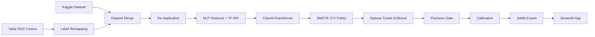

# 🔍 CCPA 2023 Compliance Classifier: Dark Pattern Detector

<p align="left">
  <a href="https://dark-patterns.streamlit.app/" target="_blank">
    
  </a>
  <a href="https://github.com/goyashek" target="_blank">
    
  </a>
</p>

A compliance auditing tool that reads website/application UI text copy (e.g., urgency flags, pre-checked opt-ins, confirm-shaming prompts) and classifies it into one of **14 categories**—India's **13 illegal dark-pattern classes** established by the **Central Consumer Protection Authority (CCPA) in November 2023** plus a *Not a Dark Pattern* (safe/benign) class.

> [!NOTE]
> **Live Auditing Tool**: Interactive Streamlit dashboard is deployed at [dark-patterns.streamlit.app](https://dark-patterns.streamlit.app/)

---

## 👨‍💻 Author & Credits
- **Created By**: [Abhishek Goyal](https://github.com/goyashek)
- **GitHub**: [github.com/goyashek](https://github.com/goyashek)
- **Kaggle Source**: Indian context compliance dataset sourced from Kaggle: **[Insert Kaggle Dataset Link Here]**

---

## 🇮🇳 Regulatory Context & Motivation

> [!IMPORTANT]
> On **30 November 2023**, India's CCPA declared **13 categories of dark patterns** illegal under the Consumer Protection Act, 2019. 
> This tool automates the compliance review of UI text strings against these enforceable legal clauses.

---

## 🔬 Bridging Academic Taxonomy and Legal Reality

This project maps the academic baseline corpus (**Yada et al. 2022**) onto CCPA legal compliance classes.

### Comparative Analysis: Baseline vs. This Project

| Feature / Metric | Yada et al. 2022 (Baseline) | This Project |
| :--- | :--- | :--- |
| **Label Space** | Binary + 7 Academic Taxonomy Classes | **14 Classes** (13 CCPA Legal Classes + Benign) |
| **Practical Context** | Academic Research | **Regulatory Compliance & Auditing** |
| **Class Coverage** | Missing legal categories, high class skew | **All 13 CCPA classes represented** |
| **Explainability** | Black-box Transformer predictions | **Interpretable NLP features** + active lexical badge triggers |
| **Inference Layer** | Raw uncalibrated model outputs | **Precision-gate thresholding + Toned-down UI confidence** |

---

## 🗺️ Pipeline & Flowchart


---

## 🛠️ Advanced Techniques & Rationale (Why We Did Them)

### 1. Global De-duplication Before Splitting
* **Why**: Prevents identical UI text strings from appearing in both train and test sets, avoiding data leakage and artificially inflated accuracy.

### 2. SMOTE Oversampling Inside Cross-Validation Folds
* **Why**: Solves class imbalance for rare classes (like *Subscription Trap*) without leaking validation partition data into the training process.

### 3. Robust Scaling and Power Transformation (Yeo-Johnson)
* **Why**: Normalizes feature distributions and dampens outliers for highly skewed metrics (like capitalization ratios and text lengths).

### 4. Cross-Validated Macro-F1 Optimization via Optuna
* **Why**: Forces the hyperparameter search to weight minority classes equally, preventing class neglect that occurs when optimizing for simple accuracy.

### 5. Shared Feature Extraction Module
* **Why**: Eliminates train-serve skew by ensuring text processing is performed identically in both training and production.

### 6. Inference-Time Precision Gate
* **Why**: Minimizes false positives by defaulting predictions with low classifier confidence (< 65%) to "Not a Dark Pattern".

### 7. UI Confidence Calibration
* **Why**: Tones down overconfident probability scores (99%+) in the Streamlit interface to display realistic compliance scores.

---

## 📂 Codebase Architecture

```
dark-pattern-pro/
├── README.md
├── requirements.txt
│
├── notebooks/
│   ├── 01_data_nlp_eda.ipynb         # EDA, tokenization & keyword extraction
│   └── 02_model_tuning_export.ipynb  # Cross-validation, Optuna tuning & export
│
├── data/
│   ├─ raw/
│       ├── dataset_raw.tsv     # Yada et al. dataset
│       └── pattern_label.csv   # dataset from kaggle
│   └──  processed/
│       ├── ccpa_dataset.tsv  # cleaned & remapped corpus
│       └── features.csv # final data after feature engineering
│
├── models/
│   ├── best_multi_model.joblib     # tuned final model
│   ├── best_binary_model.joblib    # benign model
│   └── label_encoder.joblib        # target class encoder
│
└── app/
    └── app.py              # streamlit dashboard
```

---

## 🚀 How to Run the Project

### Install Dependencies
```bash
pip install -r requirements.txt
```

### Reproduce the Modeling Pipeline
Run Jupyter Notebooks:
```bash
jupyter notebook notebooks/01_data_nlp_eda.ipynb
jupyter notebook notebooks/02_model_tuning_export.ipynb
```

### Launch the Dashboard Local Server
```bash
streamlit run app/app.py
```

---

## 🔬 The 22 Engineered NLP Features
- **Lexical/Keyword Triggers**: urge_kw_count, scarcity_kw_count, shame_phrase_flag, cancel_diff_score, social_proof_flag, price_drip_flag, discount_claim_flag, neg_option_flag.
- **Structural Indicators**: all_caps_ratio, exclamation_count, question_count, text_length, word_count, number_present, time_reference_flag.
- **Part-of-Speech (POS) Mix**: noun_ratio, verb_ratio, adj_ratio, adv_ratio.
- **TextBlob Sentiment**: sentiment_polarity, sentiment_subjectivity, and average_word_length.

---

## ⚠️ Disclaimer
> [!WARNING]
> This is a **test demonstration project** and does not constitute formal legal advice. Always consult a legal professional for compliance validation.
